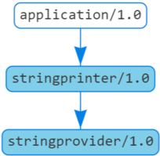

# Basic Conan demo

This small project shows how one can create and consume Conan packages as dependencies, and how Conan integrates with Artifactory to create an easily used environment for handling these dependencies.

We'll have a main application, called... `application`, as well as two dependencies; `stringprovider` and `stringprinter`. The dependency tree looks like this:

## Artifactory

Start an Artifactory instance, where we'll put our conan packages.

    docker run --name conan-artifactory -d -p 8081:8081 releases-docker.jfrog.io/jfrog/artifactory-cpp-ce:6.9.6

And if you want to mount a volume here:

    # Using git-bash on Windows
    docker run --name conan-artifactory -v $(pwd -W)/var:/var/opt/jfrog/artifactory -d -p 8081:8081 releases-docker.jfrog.io/jfrog/artifactory-cpp-ce:6.9.6

    # Others
    docker run --name conan-artifactory $PWD/var:/var/opt/jfrog/artifactory -d -p 8081:8081 releases-docker.jfrog.io/jfrog/artifactory-cpp-ce:6.9.6

Or use the docker-compose file in the artifactory folder:

    docker-compose up

Create a new Conan repository.

Add the repository in the Artifactory instance as a remote in Conan.

    conan remote add <some_name> <url>

The url is on the form `http://<domain>/artifactory/api/conan/<repository>`, e.g. `https://localhost:8081/artifactory/api/conan/conan-packages`.

On first time interacting with the remote, you'll be prompted for credentials.

More on the Conan [`user`](https://docs.conan.io/en/latest/reference/commands/misc/user.html).

## Conan

### Build the dependencies

We're starting from nothing so we'll have to first build and package the dependencies we're going to be using. These are the `stringprovider` and `stringprinter` folders.

To create a Conan package, we run:

    conan create . <package_name>/<version>@<user>/channel

So, building `stringprovider` could, e.g., be done with:

    conan create . stringprovider/0.1.0@lolpatrol/dev

And for `stringprinter`, we'd have:

    conan create . stringprinter/0.1.0@lolpatrol/dev

### Upload dependencies to Artifactory

The dependencies we built are currently only available in our local conan cache. You can view it by running:

    conan search

To put the recipe(s) in our Artifactory repository, we can run:

    conan upload <package_name>/<version>@<user>/<channel> -r <the_remote>

We can add in the argument `--all` in order to upload both recipe and package, giving:

    conan upload stringprovider/0.1.0@lolpatrol/dev --all -r conan-artifactory
    conan upload stringprinter/0.1.0@lolpatrol/dev --all -r conan-artifactory

### Build the main application

To build (and package) the main application, `application`, we can simply run the following:

    conan create . 0.1.0@lolpatrol/dev

and it will compile and run the test stuff under test_package.

If you prefer build it yourself, you can do some variation of:

    mkdir build && cd build
    conan install ..
    cmake .. && cmake --build . --config=Release

We can also delete our local cache (`~/.conan/data`), and rerun this last bit, to see that it really fetches the packages from Artifactory.
